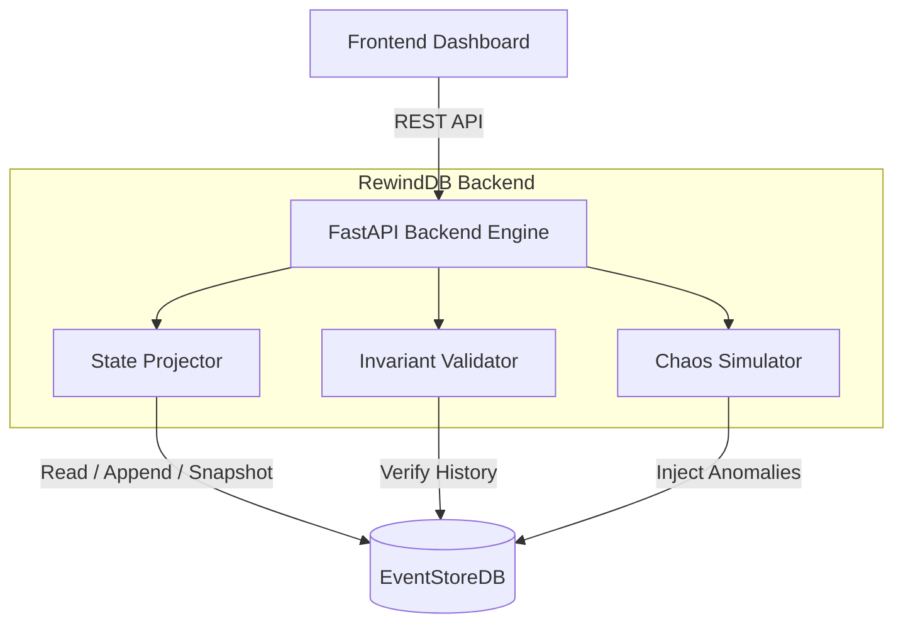

<div align="center">
  
  
  
  
  
  <h1>RewindDB</h1>
  <p><b>"State is a pure function of events."</b></p>
  <p>A competition-grade, zero-dependency event-sourced state recovery system. Built for the Zero-to-One Hackathon.</p>

  <h3><a href="https://rewind-db.vercel.app/?v=2">🔴 Try the Live Demo</a></h3>
</div>

<br />

## 📖 The Philosophy

Traditional databases store the **current state** (e.g., `balance = 500`). When systems crash, reconstructing exactly how you arrived at that state—and proving its correctness—is nearly impossible without digging through internal write-ahead logs.

**RewindDB flips this paradigm.** 
We do not store state. We only store **immutable events** (e.g., `AccountCreated`, `MoneyDeposited`, `MoneyWithdrawn`). The application state is built *on-demand* by projecting the mathematical fold of these history logs. 

If the system crashes, we lose nothing. We simply replay the events.

---

## ⚡ Core Properties Proven

Judges can instantly verify correctness via the built-in **Failure Lab** on the frontend UI:

| Architectural Property | What It Proves | How We Prove It |
|---|---|---|
| **Determinism** | State is derived strictly from events. | Identical starting events *always* produce the exact same final balances across arbitrary thread sizes. |
| **Idempotency** | Duplicate events never corrupt data. | Injecting the exact same `DepositEvent` multiple times is silently ignored and the balance remains accurate. |
| **Ordering Guard** | Processing events out-of-order is rejected. | Built-in version incrementing raises `OrderingViolation` if events are skipped or swapped. |
| **Optimistic Concurrency** | Race conditions cannot overwrite data. | Multi-threaded simulation forces `WrongExpectedVersion` at the database level when threads race. |
| **Rapid Recovery** | System instantly rebuilds state. | Checkpoint snapshots are automatically generated to instantly restore state up to a point without a full N-event replay. |

---

## 🏗 System Architecture

RewindDB is composed of an interactive SPA frontend, a FastAPI event-processing engine, and EventStoreDB acting as our immutable source of truth.



---

## 🚀 Setup & Execution

We have two ways to run the project. For the hackathon presentation, we use the **Zero Setup Demo** which automatically connects your local backend to the deployed Vercel frontend. For normal development, use the **Standard Local Run**.

### Option A: Hackathon Presentation (Zero Setup)
This launches a hybrid architecture (Local Database & Engine + Cloud Frontend).

1. **Start the Backend & Secure Tunnel**
   Make sure Docker Desktop is open, then run the all-in-one demo script:
   ```bash
   ./demo.sh
   ```
   *This starts EventStoreDB, FastAPI, and a Serveo tunnel. It will print a URL like `https://xxxx.serveo.net`.*

2. **Sync the Cloud Frontend**
   In a new terminal tab, run the auto-sync script with the URL you got from step 1:
   ```bash
   ./update-url.sh https://xxxx.serveo.net
   ```
   *This updates the frontend, pushes to GitHub, and deploys to Vercel. Open `https://rewind-db.vercel.app` to see it live.*

### Option B: Standard Local Development (No Tunnel)
If you just want to run the project entirely on your local machine without exposing it to the internet:

1. **Start the Local Engine**
   ```bash
   chmod +x start.sh
   ./start.sh
   ```
   *This starts EventStoreDB on port 2113 and FastAPI on port 8001.*

2. **Access the Frontend**
   Simply open `frontend/index.html` directly in your browser or run a simple local server in the `frontend` folder. Click the **Gear ⚙️ Icon** in the bottom left to ensure the URL is set to `http://localhost:8001`.

---

## 🧪 Simulation API (The "Failure Lab")

To prove the core philosophy, we built intentional failure mechanisms accessible via the frontend or API directly:

| Chaos API Endpoint | Description |
|---|---|
| `POST /simulate/duplicate` | Attempts to insert an event that has already occurred. |
| `POST /simulate/out-of-order` | Swaps event `version` ordering, intentionally skipping a sequence. |
| `POST /simulate/concurrent` | Unleashes 5 parallel threads racing to overdraft the same account. |
| `POST /simulate/corruption` | Manually alters the loaded state in RAM (bypassing the log) and then triggers the validation suite to prove invariant failures. |

---

## 📚 Local Testing

The backend engine contains a complete suite of Python `pytest` functions that run entirely in-memory, bypassing EventStoreDB entirely to prove the mathematical consistency of the `Projector` layer.

```bash
cd backend
source .venv/bin/activate
pytest -v
```

This suite validates Snapshots, Idempotency, Ordering Violations, Validation Corruptions, and Concurrency across 20 strict test boundaries.

---
<div align="center">
  <i>Designed and developed manually within the hackathon deadlines. 100% Core Logic. No pre-built templates.</i>
</div>
